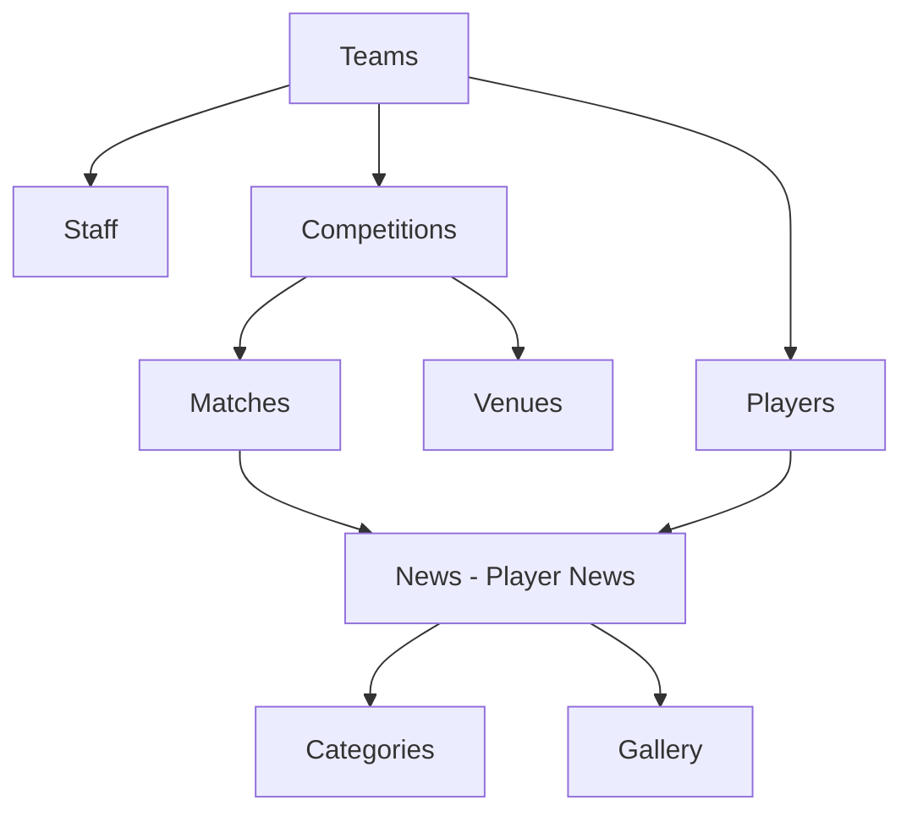

# CMS Implementation Status

## 📊 Overall Progress

| Category | Planned | Implemented | Status |
|----------|---------|-------------|--------|
| Globals | 5 | 5 | ✅ 100% Complete |
| Collections | 14 | 3 | ⏳ 21% Complete |
| Total | 19 | 8 | 🔄 42% Complete |

---

## ✅ IMPLEMENTED

### Globals (Singletons) - ALL COMPLETE ✅

| Global | File Path | Status | Features |
|--------|-----------|--------|----------|
| **Site Settings** | `/cms/src/globals/SiteSettings.ts` | ✅ Implemented | • General settings<br>• SEO configuration<br>• Maintenance mode |
| **Navigation** | `/cms/src/globals/Navigation.ts` | ✅ Implemented | • Main menu with dropdowns<br>• Internal/external links<br>• Quick links |
| **Footer** | `/cms/src/globals/Footer.ts` | ✅ Implemented | • Footer sections<br>• Social links<br>• Newsletter config<br>• App links |
| **Club Info** | `/cms/src/globals/ClubInfo.ts` | ✅ Implemented | • Club details<br>• History & values<br>• Stadium info<br>• Contact |
| **Sponsors** | `/cms/src/globals/Sponsors.ts` | ✅ Implemented | • Main sponsor<br>• Kit sponsor<br>• Official partners |

### Collections - PARTIALLY COMPLETE ⏳

| Collection | File Path | Status | Notes |
|------------|-----------|--------|-------|
| **Users** | `/cms/src/collections/Users.ts` | ✅ Implemented | Default Payload collection |
| **Media** | `/cms/src/collections/Media.ts` | ✅ Implemented | Default Payload collection for uploads |
| **Pages** | `/cms/src/collections/Pages.ts` | ✅ Implemented | Basic implementation for dynamic pages |

---

## 🔄 TO BE IMPLEMENTED

### Priority 1 - Core Football Collections

| Collection | Priority | Description | Key Fields |
|------------|----------|-------------|------------|
| **Teams** | 🔴 High | All team entities | name, type, logo, manager, captain |
| **Players** | 🔴 High | Player profiles | name, position, number, stats, biography |
| **Staff** | 🔴 High | Coaching staff | name, role, team, qualifications |
| **Matches** | 🔴 High | Fixtures & results | teams, score, date, venue, events |
| **Competitions** | 🔴 High | Leagues & cups | name, type, logo, season |

### Priority 2 - Content Collections

| Collection | Priority | Description | Key Fields |
|------------|----------|-------------|------------|
| **News** | 🟡 Medium | Articles & updates | title, content, category, author |
| **Categories** | 🟡 Medium | Content categories | name, slug, color |
| **Gallery** | 🟡 Medium | Photo/video galleries | title, items, type, date |
| **Venues** | 🟡 Medium | Stadiums | name, capacity, address, coordinates |

### Priority 3 - Enhancement Collections

| Collection | Priority | Description | Key Fields |
|------------|----------|-------------|------------|
| **FAQs** | 🟢 Low | Frequently asked questions | question, answer, category |
| **Testimonials** | 🟢 Low | Quotes & reviews | content, author, rating |
| **Tags** | 🟢 Low | Content tagging | name, slug |
| **Notifications** | 🟢 Low | Site alerts | title, message, type, dates |

---

## 📁 File Structure

```
cms/src/
├── globals/                    ✅ Complete
│   ├── SiteSettings.ts        ✅
│   ├── Navigation.ts          ✅
│   ├── Footer.ts              ✅
│   ├── ClubInfo.ts            ✅
│   └── Sponsors.ts            ✅
├── collections/               ⏳ In Progress
│   ├── Users.ts               ✅ (default)
│   ├── Media.ts               ✅ (default)
│   ├── Pages.ts               ✅ (basic)
│   ├── Teams.ts               ❌ TODO
│   ├── Players.ts             ❌ TODO
│   ├── Staff.ts               ❌ TODO
│   ├── Matches.ts             ❌ TODO
│   ├── Competitions.ts        ❌ TODO
│   ├── Venues.ts              ❌ TODO
│   ├── News.ts                ❌ TODO
│   ├── Categories.ts          ❌ TODO
│   ├── Gallery.ts             ❌ TODO
│   ├── FAQs.ts                ❌ TODO
│   ├── Testimonials.ts        ❌ TODO
│   ├── Tags.ts                ❌ TODO
│   └── Notifications.ts       ❌ TODO
└── payload.config.ts         ✅ Updated with globals

```

---

## 🚀 Next Implementation Steps

### Immediate Priority (Do Next)
1. **Teams Collection** - Foundation for player relationships
2. **Players Collection** - Core content with stats and profiles
3. **Staff Collection** - Coaching and management
4. **Competitions Collection** - For match relationships
5. **Matches Collection** - Fixtures and results

### Implementation Order Recommendation



---

## 🔗 Key Relationships to Implement

### Primary Relationships
- **Players → Teams** (Many-to-One)
- **Staff → Teams** (Many-to-One)
- **Matches → Teams** (Two relationships: home/away)
- **Matches → Competitions** (Many-to-One)
- **Matches → Venues** (Many-to-One)
- **News → Categories** (Many-to-One)

### Secondary Relationships
- **Teams → Players** (One-to-Many with join field)
- **Matches → Players** (Events, lineups)
- **Gallery → Matches** (Optional)

---

## 📝 Configuration Details

### Payload Config Location
- **File**: `/cms/src/payload.config.ts`
- **Status**: ✅ Updated with all globals
- **Collections**: Users, Media, Pages registered
- **Globals**: All 5 globals registered

### Admin Panel Access
- **URL**: http://localhost:3000/admin
- **Globals Location**: Settings group in sidebar
- **Collections Location**: Content group in sidebar

---

## 🎯 Completion Metrics

### By Priority
- **High Priority**: 0/5 collections (0%)
- **Medium Priority**: 1/4 collections (25%) - Pages implemented
- **Low Priority**: 0/4 collections (0%)

### By Type
- **Globals**: 5/5 (100%) ✅
- **Core Collections**: 0/5 (0%)
- **Content Collections**: 1/4 (25%)
- **Enhancement Collections**: 0/4 (0%)

---

## 📅 Estimated Timeline

Based on complexity:
- **Teams**: 1 hour
- **Players**: 2 hours (complex stats and relationships)
- **Staff**: 1 hour
- **Matches**: 2 hours (complex events and statistics)
- **Competitions**: 30 minutes
- **Venues**: 30 minutes
- **News**: 1 hour
- **Categories**: 30 minutes
- **Gallery**: 1 hour
- **Remaining**: 2 hours

**Total Estimated**: ~11 hours for full implementation

---

## 🐛 Known Issues

1. **React Version Mismatch**: Warning about react-dom@19.1.1 vs react@19.1.0
   - Non-critical, but should be resolved
   
2. **Multiple Lockfiles**: Warning about duplicate pnpm-lock.yaml
   - Should remove `/cms/pnpm-lock.yaml`

---

## ✅ Testing Checklist

### Globals (Complete)
- [x] Site Settings loads in admin
- [x] Navigation supports dropdowns
- [x] Footer sections are editable
- [x] Club Info tabs work correctly
- [x] Sponsors can be added/edited

### Collections (To Test When Implemented)
- [ ] Teams CRUD operations
- [ ] Players with image uploads
- [ ] Match events timeline
- [ ] News publishing workflow
- [ ] Gallery media management

---

Last Updated: 2025-08-16 21:45 UTC